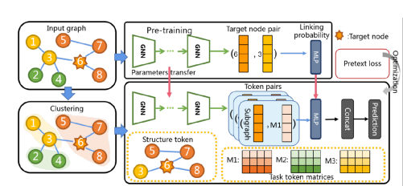
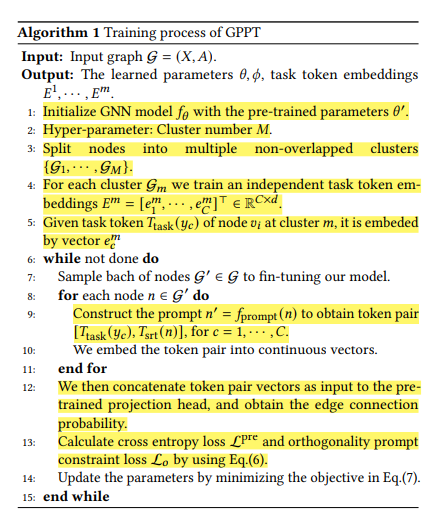
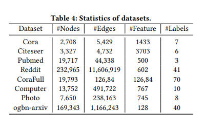

# Prompting over Graphs : GPPT

In this note, I will cover the following paper [ GPPT: Graph Pre-training and Prompt Tuning to Generalize Graph Neural Networks](https://dl.acm.org/doi/abs/10.1145/3534678.3539249)

_**NOTE**_ : Definition of [[in-context-learning|In-context Learning (ICL)]] is already covered. First, I will cover GPPT which is based on Graph prompts. Finally, moving ahead from prompting, we will see how [[icl-over-graphs-PRODIGY|ICL : PRODIGY]] introduces ICL over graphs.

## 1. Abstract

### 1.1 Motivation

-  The supervised training of GNNs notoriously requires large amounts of labeled data for each downstream task.
-  Alternative : Use Transfer Learning -  using easily accessible information to pre-train GNNs, and fine-tuning them to optimize the downstream task with only a few labels.
-  Design the self-supervised pretext tasks, and encode the universal graph knowledge among the various applications.
-  In rare cases, there is inherent training objective gap between the pretext and downstream tasks.
-  This may lead to costly fine-tuning process to adapt the pre-trained GNNs to the downstream tasks.
-  The naive pre-training strategy usually deteriorates the downstream task and reduces the reliability of transfer learning on graph.
-  Long fine-tuning leads to forgetting of the pre-trained general knowledge. ([Catastrophic Forgetting](../Definitions/index#pre-train-fine-tune))

### 1.2 Contributions of this Paper

- Novel transfer learning paradigm to generalize GNNs, namely **graph pre-training and prompt tuning (GPPT)**.
- **Masked Edge Prediction** is used as pretext task to pre-train GNNs.
- Node Prediction ✅, Link Prediction ❌, and Graph Classification ❌.
- Graph Prompting function reformulates the downstream task by modifying the _standalone node_ into a _token pair_ and makes it similar to the pre-training task, i.e, edge prediction.
- The _token pair_ consists of **node entity** (structure token) and **candidate label class** (task token).
- Instead of "_pre-train, fine-tune_" paradigm, GPPT uses "_pre-train, prompt, fine-tune_" paradigm.

## 2. Introduction

{: .center style="height:300px;width:90%"}

- Task Token : They are the node labels represented by the trainable continuous vectors. It is appended to the the embedding of the target sample. The linking probability between task token and target sample is directly measured through using the pre-trained model.
```
The orthogonal prompt initialization and regularization are proposed to separate the trainable vectors of different labels.
```
- Structure Token : It represents the target sample with its multi-hop neighbourhood.

## 3. Related Work (Graph Pre-training)

- **GCC** : Leverages contrastive learning to capture the universal network topological properties across multiple networks.
- **GPT-GNN** : Introduces a self-supervised attributed graph generation task to pre-train GNN models that can capture the structural and semantic properties of the graph.
-  **L2P-GNN** : Utilizes meta-learning to learn the fine-tune strategy during the pre-training process.

## 4. Preliminary Knowledge

### 4.1 GNN

- Let tuple $\mathcal{G} = (X, A)$ denote undirected graph, where $X \in  \mathbb{R}^{N \times d}$ is node feature matrix and $A \in \mathbb{R}^{N \times N}$ is adjacency matrix. 
-  Suppose the number of graph convolutional layers is $K$. To facilitate the following expression, we use $h_i = f_\theta (\mathcal{G}, v_i)$ to represent the final node representation learned from $K$-layer GNNs, where $\theta = \{\theta^{(1)}, \theta^{(2)}, \cdots , \theta^{(K)}\}$ denotes the concatenated trainable parameters.

### 4.2 Pre-train and Fine-tune GNNs

The edge prediction pretext task works as follows - 

- Randomly mask partial edges and then train GNNs to reconstruct them.
- Formally, let $\mathcal{G}^{pre} = (X, A^{pre})$ denote masked graph. Node Embedding of $v_i$ is given by  $h_i = f_\theta (\mathcal{G}^{pre}, v_i)$.
- Pretext task is to determine whether a node pair is connected, where loss is defined as follows :

    $$\min_{\theta, \phi} \sum_{(v_i, v_j)} \mathcal{L}^{pre} (p_{\phi}^{pre}(h_i, h_j); g(v_i, v_j))$$

    Node pair $(v_i, v_j)$ is either masked edge or sampled negative unconnected pairs. $p_{\phi}^{pre}$ is projection head to evaluate similarity score of node pair. $g(v_i, v_j)$ is ground truth label of the node pair (i.e., $A_{ij}$).

Now, under fine-tuning, following loss is optimized -

$$\min_{\theta, \psi} \sum_{v_i} \mathcal{L}^{down}(p_{\psi}^{down}(h_i); g(v_i))$$  

- $\theta_{init} = \theta_{pre}$, i.e., GNNs are initialized by the optimized parameters from pretext task.
- $p^{down}_{\phi}(h_i)$ denotes the new projection head accompanied with parameters $\phi$, while the pretext projection head is discarded. 
- $L^{down}$ is the downstream loss function (e.g., cross entropy), and $g(v_i)$ denotes the ground-truth label of node $v_i$.

## 5. Graph Prompting Framework

- First, we note that GNNs’ parameters $\theta$ are optimized to generate close embeddings for connected node pairs, instead of nodes of the same class. If the disconnected pairs share the same class, the pretrained model requires to be tuned with many epochs to adapted to the new problem. 
- This time-consuming fine-tuning prevents us from efficiently using the pre-trained model. The pre-trained knowledge will also be gradually filtered out in the long tuning process.
- Second, in the initial stage of fine-tuning, the pre-trained model is not well adapted to the downstream task, and gives wrong classifications.

### 5.1 How to use Prompt?

- For $v_i$, generate prompt $v_i^{'} = f_{prompt}(v_i) = [T_{task}(y), T_{srt}(v_i)]$ = [task token, structure token].
- Given the token pairs, $[T_{task}(y), T_{srt}(v_i)]$, by embedding them into continuous tensors, one is able to conduct the classification task by fitting the linking probability between the two tokens.

GPPT consists of 3 componets -->

1. **Prompt Addition :** The graph prompting function generates a series of token pairs to be classified. Assuming that there are total $C$ classes $[y_1, y_2, \cdots, y_C]$, we construct their corresponding token pairs $[T_{task}(y_c), T_{srt}(v_i)]$, for $c = 1, 2, \cdots, C$.
2. **Prompt Answer :** Given each token pair $[T_{task}(y_c), T_{srt}(v_i)]$, we embed them into continuous vectors. We then concatenate them as input to the _pre-trained projection head_, and obtain the linking probability. We answer and classify target node $v_i$ with label $y_c$ if it obtains the highest probability.
3. **Prompt Tuning :** Following the pretext training objective, following loss is optimized :

    $$\min_{\theta, \phi} \sum_{(v_i, y_c)} \mathcal{L}^{pre} (p_{\phi}^{pre} (T_{task}(y_c), T_{srt}(v_i)); g(y_c, v_i))$$

    - $p_{\phi}^{pre}$ is the _pre-training projection head_ to evaluate the linking probability of the token pair.
    - $g(y_c, v_i)$ denotes the ground truth connection between label class $y_c$ and target node $v_i$.

### 5.2 Prompt Function Design

#### 5.2.1 Task Token Generation

- The task token $T_{task} (y_c)$ is embedded into a trainable vector: $e_c = T_{task} (y_c) \in \mathbb{R}^d$.
- For the total $C$ classes in the downstream node classification, the task token embeddings are defined by: $E = [e_1, \cdots, e_C] \in \mathbb{R}^{C \times d}$.
- Task token is basically class-prototype node added to the original graph. 
- **NOTE :** The optimal embedding of task token $T_{task} (y_c)$ should be at the center of node embeddings of the class $y_c$.

Importance of cluster structure in graphs -->

-  It would be hard for the distinct nodes over graph to use and tune the single task token embeddings $E$.
-  Given the edge prediction pretext task, the pre-trained node embeddings will also be clustered in the embedding space.
-  The optimal embedding of task token $T_{task} (y_c)$ should thus vary with clusters. 
-  To do better node classification at each cluster, do the _cluster-based task token generation_, consisting of 3 steps:
    1. Use _scalable clustering module_ (e.g., METIS) to split nodes into **non-overlapping clusters** : $\{\mathcal{G}_1, \cdots, \mathcal{G}_M\}$ where $M$ is hyper-parameter of cluster number.
    2. For each individual cluster $m$, there will be an independent task token embeddings : $E^m = [e^m_1, \cdots, e^m_C] \in \mathbb{R}^{C \times d}$.
    3. `NOTE:` For task token $T_{task}(y_c)$ for node $v_i$ belonging to cluster $m$, it's embedding is : $e_c^m$.

#### 5.2.2 Structure Token Generation

- According to social network theory, proximal nodes tend to possess similar features and node labels.
- It also provides redundant information which makes the classification decision robust.
- Structure token $T_{str} (v_i)$ denotes subgraph centered at node $v_i$.
- Used **1-hop** neighbourhood only.
- The structure token $T_{str} (v_i)$ is embedded into a continuos vector as :

$$e_{v_i} = T_{str} (v_i) = a_i * h_i + \sum_{v_j \in \mathcal{N}(v_i)} a_{j} * h_j$$

- $a_i$ are the attention weights learned from the attention function.

### 5.3 Prompt Initialization and Orthogonal Prompt Constraint

Prompt Initialization -->

- Optimal node embeddings should be at center of node embeddings. Random initialization may deteriorate the classification at initial stage.
- Thus, for each cluster $m$, task token $e_c^m$ is initialized as the mean of node embeddings of _training nodes_ of class $y_c$ in cluster $m$.
- This means initialization provides the valid task tokens, and ensures the correct classification at the initial stage.

Orthogonal Prompt Constraint -->

- **NOTE :** To conduct correct node classification, the task token embeddings of different classes should be irrelevant to each other.
- Thus, orthogonality of task token is enforced during model fine-tuning. 

$$\mathcal{L_o} = \sum_{m} || E^m (E^m)^T - I ||_F^2$$ 

### 5.4 Overall Learning Process

1. Pre-training : Done using masked edge prediction.
2. Prompt Addition : Modifies the target node $v_i$ as token pair $[T_{task}(y_c), T_{str}(v_i)] = [e_c^m, e_{v_i}]$.
3. Prompt Answer : Evaluates the class of node by assigning the task token which has highest linking probability. **NOTE:** The linking probability is evaluated by the _pre-trained_ projection head.
4. Prompt Tuning (or Fine Tuning) :  Optimizes the GNNs and token embeddings as follows -

    $$\min_{\theta, \phi, E^1, \cdots, E^M} \sum_{(v_y, y_c)} \mathcal{L}^{pre} (p_{\phi}^{pre} (e_c^m, e_{v_i}); g(y_c, v_i)) + \lambda \mathcal{L}_o$$ 

    - $\theta^{init} = \theta^{pre}$, and $\phi^{init} = \phi^{pre}$.
    - $\lambda$ is the loss hyper-parameter.
    - $\phi^{pre}$ is the pre-trained parameters of the projection head.

### 5.5 Pseudo-Algorithm

{: .center style="height:80%;width:60%"}

## 6. Experimental Setup

1. _Datasets_ : These datasets are available in PyG or DGL library.
{: .center style="height:80%;width:60%"}
2. _Batch Size_ : The batch sizes are 256 - Cora, 256 - Citeseer, 2048 - CoraFull, 256 - Pubmed, 4096 - Ogbn-arxiv, 2048 - AmazonCoBuyComputer, 4096 - AmazonCoBuyPhoto, and 4096 - Reddit.
3.    - _Number of layers_ : 2 and _Hidden units_ of 128 for GNNs  
      - _Optimizer_ : Adam  
      - _Learning Rate_ : [0.001, 0.005]  
      - _Weight Decay_ : 0.0005  
      - _Loss Hyper-parameter_ : $\lambda = 0.01$  
      - _Clustering Number_ : $M =$ 7 (Cora), 6 (Citeseer), 3 (Corafull), 5 (Pubmed), 10 (Ogbn-arxiv), 8 (AmazonCoBuyComputer), 10 (AmazonCobuyPhoto), 10 (Reddit) 

### 6.1 Github Code

- Offficial github code for this paper is at [GPPT](https://github.com/MingChen-Sun/GPPT)
- Working code implemented by me is available at [GPPT-working](https://github.com/pratzohol/GPPT-working)

## 7. Doubts

1. How is $a_i$ weights of attention function learned in [structure token generation](#522-structure-token-generation)? 
2. How does the [orthogonal constraint](#53--prompt-initialization-and-orthogonal-prompt-constraint) equation enforces orthogonality of task token embeddings?

[//begin]: # "Autogenerated link references for markdown compatibility"
[in-context-learning|In-context Learning (ICL)]: ../Miscellaneous/in-context-learning "In-context Learning (ICL)"
[icl-over-graphs-PRODIGY|ICL : PRODIGY]: icl-over-graphs-PRODIGY "ICL : PRODIGY"
[//end]: # "Autogenerated link references"