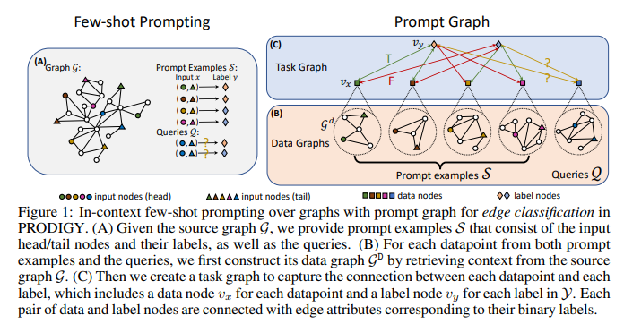

# ICL over Graphs : PRODIGY

In this note, I will cover the following paper ["PRODIGY : Enabling in-context learning over graphs"](https://arxiv.org/abs/2305.12600).

_**NOTE**_ : Definition of [[in-context-learning|In-context Learning (ICL)]] is already covered.


## 1. Introduction

We can easily infer that the in-context learning is a novel and one of the most intriguing capabilities of language models. However, how to enable in-context learning over graphs is still an unexplored question.

An in-context learner for graphs should be able to solve novel tasks on novel graphs. For example, give music product recommendations on Spotify when being trained on Amazon purchasing graph.

## 2. Challenges
1. How to formulate and represent node-, edge- and graph-level tasks over graphs with a _unified task representation_ that allows the model to solve diverse tasks without the need for retraining or parameter tuning.
2. How to design model architecture and pre-training objectives that enable in-context learning capabilities across _diverse tasks_ and _diverse graphs_ in the unified task representation.
3. Existing _graph pre-training methods_ only aim to learn good graph encoder and require fine-tuning to adapt to different tasks, while existing _meta-learning methods_ over graphs only aim to generalize across tasks within same graph.

```
Achieving in-context learning requires generalizing across different graphs and
tasks without fine-tuning or parameter tuning.
```

### 2.1. How to tackle this?

The general approach presented to solve these problems as described in this paper is :

- **_Prompt Graph_** : It provides a way to unify the representation of node-, edge- and graph-level tasks over graphs. It has prompt examples, queries and connected with additional label nodes as shown in Figure below.

    

    - This is an example of in-context few shot prompting over graphs for edge classification.
    - (A) Given source graph $\mathcal{G}$, we provide prompt examples $\mathcal{S}$ and queries $\mathcal{Q}$. $\mathcal{S}$ consist of input head and tail nodes and their labels.
    - (B) For each data-point in $\mathcal{S}$ and $\mathcal{Q}$, we construct its _Data graph_ $\mathcal{G}^D$ using the source graph $\mathcal{G}$.
    - (C) Then, we create *Task graph* to capture connection between each data-point and label. We learn embedding to represent Data graph as nodes $v_x$ for each data-point. There are label nodes $v_y$ for each y $\in \mathcal{Y}$. Each data-point is connected to every label nodes. For data-points in $\mathcal{S}$, each edge is marked by a boolean value, $\texttt{T}$ for true label and $\texttt{F}$ for others. 

- **_PRODIGY_** : **Pr**etraining **O**ver **D**iverse **I**n-Context **G**raphs S**y**stems, which is a framework for pre-training in-context learner over prompt graphs.
    - PRODIGY designs both model architecture and pre-training objectives with in-context task formulation over prompt graph.
    - Model architecture uses GNN to learn embeddings of node/edge representations and an attention mechanism for message passing over prompt graph.

## 3. In-Context Learning over Graphs

### 3.1. Classification Tasks

- Graph is defined as $\mathcal{G} = (\mathcal{V}, \mathcal{E}, \mathcal{R})$ where $\mathcal{V}$ is set of nodes, $\mathcal{E}$ is set of edges and $\mathcal{R}$ is set of relations. An edge $e = (u, r, v) \in \mathcal{E}$ consists of two nodes $u$, $v$ and a relation $r \in R$.
- Levels of classification :
    - Node-level : Given set of classes $\mathcal{Y}$, predict class label $y \in \mathcal{Y}$ for each node $v \in \mathcal{V}$. Hence, $\mathcal{X} = V$.
    - Edge-level : Predict label of potential edges formed by any pair of nodes, i.e., $\mathcal{X} = V \times V$. A common special case is that classes are same as the relations, i.e., $\mathcal{Y} = \mathcal{R}$.
    - Graph-level : Predict label on sub-graphs, i.e., input consists of nodes and edges both.
- Since, we want uniform formulation for different levels of tasks, we define space of input $\mathcal{X}$ consists of graphs, i.e., $x_i \in \mathcal{X}$ where $x_i = (\mathcal{V}_i, \mathcal{E}_i, \mathcal{R}_i)$.
    - For node-level classification, $|\mathcal{V}_i| = 1$ and $|\mathcal{E}_i| = 0$
    - For edge-level classification, $|\mathcal{V}_i| = 2$ and $|\mathcal{E}_i| = 0$
    (Since, we are predicting label of potential edges, we don't have any edges in the input, and instead input consists of pair of nodes)
### 3.2. Few-shot Prompting

- For a _k_-shot prompt with downstream _m_-way classification tasks with $|\mathcal{Y}| = m$ classes, we use small number of input-label pairs $\mathcal{S} = \{(x_i, y_i)\}_{i=1}^{m \cdot k}$ as _prompt examples_. Here, we have _k_ samples for each label (class) $y \in \mathcal{Y}$.
- Set of queries $\mathcal{Q} = \{x_i\}_{i=1}^n$ is also sampled. We want to predict labels for each query $x_i \in \mathcal{Q}$.
- _Important_ difference between graphs and language models w.r.t. prompting is that the source graph $\mathcal{G}$ contains information about the input, and hence, we need to include $\mathcal{G}$ in the prompt.

## 4. PRODIGY (Solution)

### 4.1. Prompt Graph Representation

Given the information as a prompt, the pre-trained model should be able to directly output the predicted labels for the queries via in-context learning. Thus, to formulate information as unified and efficient form of input, this paper proposes their _in-context task formulation prompt graph_.

1. **_Data graph_** : We perform _contextualization_ of each data-point in $\mathcal{S}$ and $\mathcal{Q}$ using source graph $\mathcal{G}$. We want to have more information about the data-point $x_i = (\mathcal{V}_i, \mathcal{E}_i, \mathcal{R}_i)$ without having to represent the whole source graph $\mathcal{G}$.
    - Intuitively, it makes sense to sample a $k$-hop neighborhood to construct data graph $\mathcal{G}^D$.
    - Formally, $\mathcal{G}_i^D = (\mathcal{V}_i^D, \mathcal{E}_i^D, \mathcal{R}_i^D) \sim \bigoplus_{j = 0}^ k \texttt{Neighbor} (\mathcal{V}_i, \mathcal{G}, j)$, where $\texttt{Neighbor}$ is a function which returns exact $j$-hop neighborhood of each node in $\mathcal{V}_i$ in $\mathcal{G}$.
    - NOTE : $\bigoplus$ is a direct sum operator. In this case it means that
        - For example, suppose {$v_1$, $v_2$, $v_3$} $\in \mathcal{V}_i$, and $\forall m = {1, 2, 3},  
              (\mathcal{V}_{i, m}, \mathcal{E}_{i, m}, \mathcal{R}_{i, m}) =$ subgraph obtained by sampling $k$-hop neighbourhood of node $v_m \in \mathcal{V}_i$. Then,
        - $\mathcal{V}_i^D = \bigcup_{m = 1}^3 \mathcal{V}_{i, m}$
        - $\mathcal{E}_i^D = \bigcup_{m = 1}^3 \mathcal{E}_{i, m}$
        - $\mathcal{R}_i^D = \bigcup_{m = 1}^3 \mathcal{R}_{i, m}$
    - _Input Node Set_ : For the data graph $\mathcal{G}^D$, the nodes in $\mathcal{V}_i$ (before contextualization) correspond to this set. For node classification, it is a single target node whereas for link prediction it is a pair of nodes.
2. **_Task graph_** : After contextualizing each data-point to a data graph $\mathcal{G}^D$, we then construct task graph $\mathcal{G}^T$ to better capture the connection and relationship among the inputs and the labels.
    - For each data graph $\mathcal{G}_i^D$, we represent the input as _data node_ $v_{x_i}$.
    - For each label $y_i \in \mathcal{Y}$, we represent the label as _label node_ $v_{y_i}$.
    - So, overall task graph contains $m \cdot k + n$ _data nodes_ and $m$ _label nodes_. ($m \cdot k$ _prompt examples_ and $n$ _queries_)
    - For the query set, we add single directional edge from each label node to each query data node.
    - For prompt examples, each data node is connected to every label node via bidirectional edges, where edge with true labels are marked as $\texttt{T}$ and rest are marked as $\texttt{F}$.

### 4.2. Pre-training

#### 4.2.1. Message Passing Architecture over Prompt Graph

#### 4.2.2. In-context Pre-training Objectives

##### Pre-training Task Generation

##### Prompt Graph generation with augmentation

##### Pre-training Loss

[//begin]: # "Autogenerated link references for markdown compatibility"
[in-context-learning|In-context Learning (ICL)]: ../Miscellaneous/in-context-learning "In-context Learning (ICL)"
[//end]: # "Autogenerated link references"
