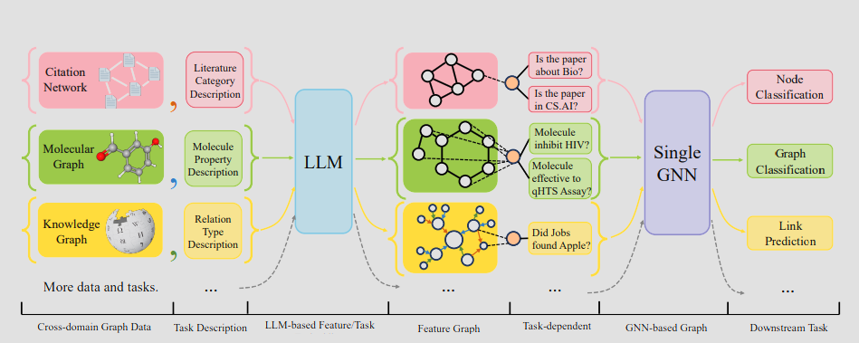
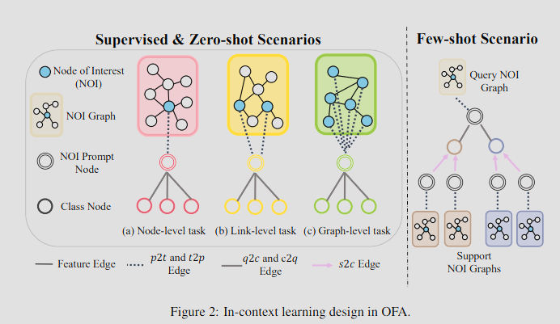

# ICL over Graphs : OFA

In this note, I will cover the following paper ["ONE FOR ALL: TOWARDS TRAINING ONE GRAPH MODEL FOR ALL CLASSIFICATION TASKS"](https://arxiv.org/pdf/2310.00149v1.pdf). This paper benchmarks against [[icl-over-graphs-prodigy|ICL : PRODIGY]]. 

_**NOTE**_ : Definition of [[in-context-learning|In-context Learning (ICL)]] is already covered.

## 1. Overview

1. LLMs are used to encode node, edge, graph level information. These are called Text-attributed graphs (TAGs).
    - OFA uses TAGs to integrate graph datasets from different domains into one large TAG dataset and leverages the power of LLMs to learn from all domains jointly.
    - All nodes and edges in the graphs are described using human-readable texts and embedded from different domains into the same embedding space with a single LLM.
2. OFA introduces the concept of nodes-of-interest (NOI) to standardize different tasks with a single task representation.
    - NOI subgraph and NOI prompt node unifies different types of tasks.
    - It improves the ability of fondation model to learn structural information.
3. For ICL on graphs,  OFA introduces a novel graph prompting paradigm (GPP) which enables it to address various tasks without fine-tuning.
    - It inserts prompt graph into original graph in a task-specific way.
    -  The nodes in the prompt graph contain all related information about the downstream task. 
    -  Then, the modified graph becomes the actual input to the foundation model.

{.center}

### 1.1. Comparison with PRODIGY

- OFA utilizes LLMS to encode node, edge and graph level information using text prompts whereas PRODIGY just encodes the textual feature of nodes.
- OFA supports zero-shot prompting whereas PRODIGY only supports few-shot prompting.
- Cross domain graphs cannot be handled by PRODIGY whereas OFA encodes cross domain graphs using LLMs.

## 2. One-For-All : Foundation Model

{.center}

### 2.1. Text-attributed Graphs (TAGs)

- For node feature, $s_{v_i}$ = `Feature node. <f desc>:<f content> ; <f desc>:<f content> ; ...` prompt is used where `<f desc>` is the description of the feature and `<f content>` is the content of the feature.
- Similary for edge feature $s_{e_{ij}}$, they use `Feature edge` in place of `Feature node`.
- For node $v_i$ and edge $e_{ij}$, their vector representations are $x_i$ = LLM($s_{v_i}$) and $x_{ij}$ = LLM($s_{e_{ij}}$) respectively.
- In OFA, they used SentenceTransformer to encode the text into vectors.
- LLMs capture the domain information of features which is passed down to the foundation model.

### 2.2. Nodes-of-Interest (NOI)

- **NOI** refers to the blue nodes in the above figure. It is single node for node classification and pair of nodes for link prediction.
- **NOI subgraph** is the $h$-hop neighborhood of NOI node(s).
- **NOI prompt node** connects to all the nodes in **NOI**.
    - It has the task prompt `Prompt node. <task desc>`.
    - Through message passing, NOI prompt node summarizes information in NOI and task description.
    - NOTE : Other works utilize the subgraph and then pool the information to unify different tasks. In contrast, OFA uses NOI prompt node to unify different tasks and thus eliminates the need for explicit pooling and instead, directly uses message passing.

### 2.3. Graph Prompting Paradigm (GPP) for Graph ICL 

- **Prompt Graph** consists of 2 types of nodes : 1) NOI prompt node $p_q$ and, 2) class nodes $c_i$.
- Class node $c_i$ has the prompt `Prompt node. <class desc>`.
- Relation type of edges from NOI to NOI prompt node is $r_{t2p}$ and $r_{p2t}$ for reverse edge.
- Relation type of edges from NOI prompt node to class node is $r_{q2c}$ and $r_{c2q}$ for reverse edge.
- Relation type of edges from NOI prompy node of support examples to class node is $r_{s2c}$ and $r_{c2s}$ for reverse edge.
- Since $r_{s2c}$ and $r_{q2c}$ differs, model can differentiate between query and support examples.
- **Prompted graph**, $\mathcal{G}_m$ is the NOI subgraph + prompt graph. This *prompted graph* is input to the subsequent graph model.

### 2.4. Prediction

- Let $h_{c_i}$ be the vector representation of class node $c_i$ after the graph model is applied.
- $\mathbb{P}\text{[NOI belongs to class i]} = \sigma(\text{MLP}(h_{c_i}))$. Take $\text{argmax}$ to get the class label.
- $h_{c_i}$ contains class description, NOI information and task information and hence, prediction is task dependent.
- GNN capable of recognizing different edge types serves as graph model in OFA.

## 3. Related Work

{.center}

## 4. Implementation of OFA

## 5. Experiments

[//begin]: # "Autogenerated link references for markdown compatibility"
[icl-over-graphs-prodigy|ICL : PRODIGY]: ../Graph_Neural_Networks/icl-over-graphs-prodigy "ICL : PRODIGY"
[in-context-learning|In-context Learning (ICL)]: ../Miscellaneous/in-context-learning "In-context Learning (ICL)"
[//end]: # "Autogenerated link references"