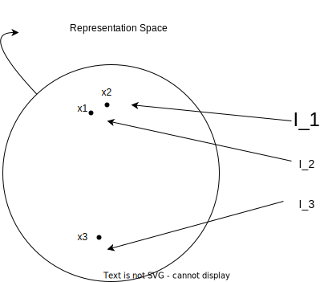

# Contrastive Learning

## 1. Definition

> Contrastive learning aims at learning low-dimensional representations of data by contrasting between similar and dissimilar samples.

What this means is that it tries to bring similar samples close to each other in the representation space and push dissimilar samples away from each other.

Let's suppose we have 3 images, $I_1$, $I_2$ and $I_3$, where $I_1$ and $I_2$ belongs to same class (e.x. dog) and $I_3$ belongs to different class (e.x. cat). The representation space will look something like this:



We see that the distance $d(x_1, x_2)$ is small compared to $d(x_1, x_3)$ and $d(x_2, x_3)$ where $d()$ is a metric function like euclidean.

[//]: # (comment in markdown looks like this)

## 2. Loss Functions

### 2.1. Contrastive Loss

We suppose that we have a pair ($I_i$, $I_j$) and a label $Y$ that is equal to 0 if the samples are similar and 1 otherwise. To extract a low-dimensional representation of each sample, we use a Convolutional Neural Network $f$ that encodes the input images $I_i$ and $I_j$ into an embedding space where $x_i = f(I_i)$ and $x_j = f(I_j)$. The contrastive loss is defined as:  

$$\mathbf{L = (1-Y) * ||x_i - x_j||^2 + Y * max(0, m - ||x_i - x_j||^2)}$$

where $m$ is a hyperparameter, defining lower bound distance between dissimilar samples.  
This can be thought of as :  

* If $Y = 0$, then samples are similar and hence, we want to minimize the distance between $\mathbf{x_i}$ and $\mathbf{x_j}$.  
* If $Y = 1$, then samples are dissimilar and minimizing $\mathbf{L}$ means we want to make the term $m - ||x_i - x_j||^2$ $\leq$ 0. Thus, we want the distance between $\mathbf{x_i}$ and $\mathbf{x_j}$ to be maximized and greater than the lower bound $m$.
* [NOTE :] This is not a classification task. We are trying to learn the embedding $\mathbf{x_i}$ for the $i$-th sample.

### 2.2. Triplet Loss

It takes triplet as input : an anchor sample $I$, a positive sample $I^{+}$ and a negative sample $I^{-}$. During training, the loss function enforces the distance between anchor and positive sample to be less than the distance between anchor and negative sample.

The triplet loss is defined as:

$$\mathbf{L = max(0, ||x - x^{+}||^2 - ||x - x^{-}||^2 + m)}$$

where $m$ is a hyperparameter defined in contrastive loss. Here also, we want dissimilar to be far and similar to be close so that the term $||x - x^{+}||^2 - ||x - x^{-}||^2 + m$ $\leq$ 0.

## 3. Types of Learning

### 3.1. [Self-Supervised Learning](types-of-learning.md#2-unsupervised-learning)

When we don't have labeled samples, we use unsupervised learning, also known as self-supervised learning.

A famous self-supervised framework for unsupervised contrastive learning is [**_SimCLR_**](https://arxiv.org/abs/2002.05709). Its main idea is to generate positive image pairs by applying random transformations in the anchor image like crop, flip and color jitter since these changes keep the label of the image unchanged.

### 3.2. [Supervised Learning](types-of-learning.md#1-supervised-learning)

The label of each sample is available during training. So, we can generate positive and negative pairs or triplets by just looking at the labels. 

_Positive Pairs : Samples with same label_  
_Negative Pairs : Samples with different label_

However, generating all possible pairs or triplets requires a lot of time and computational resources. Also, in every dataset, there are many negative pairs or triplets that already satisfy the contrastive training objectives and give zero loss resulting in slow training convergence.

To deal with this problem, we have to generate _hard pairs_ and _hard triplets_, meaning that their loss value is high, i.e., similar pairs that are far apart and dissimilar pairs that are very close. 

Many hard negative mining methods have been proposed that usually look into the representation space for hard pairs and triplets using fast search algorithms.

```
It only makes sense that this kind of contrastive learning will be used mostly with self-supervised (unsupervised) or semi-supervised settings.
```

## 4. Related Discussion

1. Different types of Learning in Machine Learning setting is covered in this post [[types-of-learning|Types of Learning]].


[//begin]: # "Autogenerated link references for markdown compatibility"
[types-of-learning|Types of Learning]: types-of-learning "Types of Learning"
[//end]: # "Autogenerated link references"