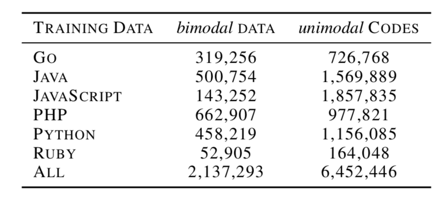
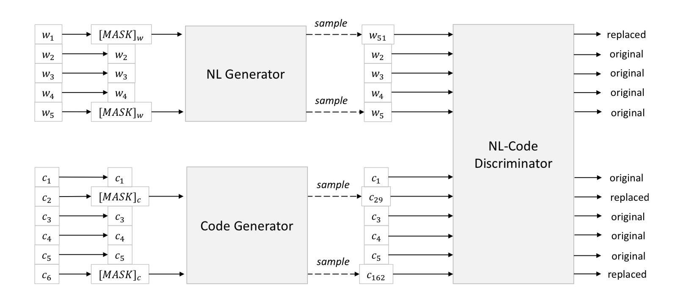
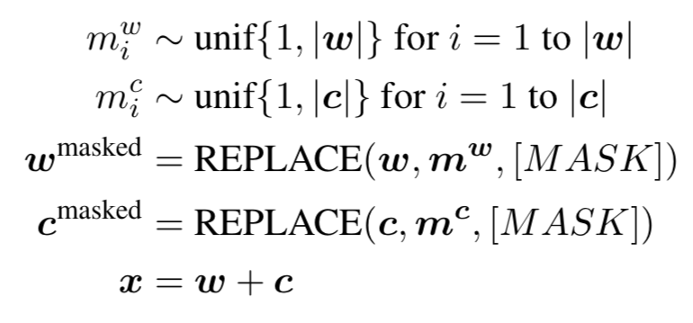
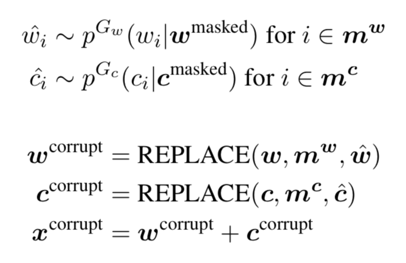

# CodeBERT

## 1. Architecture

CodeBERT uses bidirectional transformer and same architecture as RoBERTa-base. Total Number of parameters = 125M. It works as an encoder.

## 2. Pre-training Data

- CodeBERT uses **CodeSearchNet** Corpus.

CodeBERT makes use of both _bimodal_ NL-PL data and _unimodal_ NL + PL data.  
_bimodal_ : code paired with natural language documentation.  
_unimodal_: code without NL or NL paired without code.

{: style="height:50%;width:50%"}

### 2.1 I/O Representation

- Input :  $[CLS], w_1, w_2, ..., w_n, [SEP], c_1, c_2, ..., c_m, [EOS] \longleftarrow$  concat NL with PL
- Output : contextualized embedding for each token, for both NL & PL, and embedding of  $[CLS]$  token which is used as aggregate representation of sequence for classification or ranking task.

## 3. Pre-training Objective

CodeBERT uses both **Masked Language Modeling (MLM)** and **Replaced Token Detection (RTD)** as pre-training objectives.

{.center : style="height:90%;width:90%"}

### 3.1 MLM

- Uses only the _bimodal_ data. 

Given a NL-PL pair, $\boldsymbol{x} = \{\boldsymbol{w}, \boldsymbol{c}\}$, we select random positions to mask-out ($\boldsymbol{m^w}$ and $\boldsymbol{m^c}$) and replace them with $[MASK]$ token. Around **15%** of tokens are masked out.

{.center : style="height:40%;width:40%"}

MLM objective predicts the original token which were masked out. NOTE: $p^{D_1}$ is the discriminator which predicts probability distribution over vocabulary $V$.

$$
\mathcal{L}_{\text{MLM}}(\theta) = \sum_{i \in \boldsymbol{m^w} \cup \boldsymbol{m^c}} \left[ -\log p^{D_1}(x_i \mid \boldsymbol{w}^{\text{masked}}, \boldsymbol{c}^{\text{masked}}) \right]
$$

### 3.2 RTD

- Uses both _unimodal_ and _bimodal_ data.

We use two _generators_, $p^{G_w}$ (NL) and $p^{G_c}$ (PL). These are implemented as n-gram language models with bidirectional context.  

{.center : style="height:40%;width:40%"}

We generate alternative token for masked positions. Discriminator is trained to output probability of the token being "real". This is done for every position in the input.

$$
\mathcal{L}_{\text{RTD}}(\theta) = 
-
\sum_{i = 1}^{|\boldsymbol{w}| + |\boldsymbol{c}|} 
\delta(i) \cdot 
\log p^{D_2} \left(\boldsymbol{x}^{\text{corrupt}}, i\right) +
\left(1 - \delta(i)\right) \cdot \log \left(1 - p^{D_2} (\boldsymbol{x}^{\text{corrupt}}, i)\right)
$$

$$
\text{where} \quad \delta(i) = 
\begin{cases}
1, & \text{if } x_i^{\text{corrupt}} = x_i. \\
0, & \text{otherwise.}
\end{cases}
$$

## 4. Experiments 

Authors of original paper have taken 4 downstream NL-PL tasks.

1. Natural Language Code Search
2. Late Fusion for Code Search
3. NL-PL Probing
4. Code Documentation Generation
5. Code Summarization on C# (not in pre-training data)

### 4.1 NL Code Search

- TASK: Take natural language as input, find most semantically related code.
- METRIC: [MRR](../mrr.md) for each pair of test data over a fixed set of 999 distractor codes.
- EXTRA PARAMS: A binary classification head, where $softmax$ is connected to $[CLS]$ token's embedding.
- CodeBERT is fine-tuned along with classification head.

### 4.2 Late Fusion (Code Search)

- CodeBERT first encodes both NL and PL separately.
- Code Search is now equivalent to find nearest neighbor in the "shared" vector space.
- Fine-tune CodeBERT with the following objective: 

$$
- \dfrac{1}{N} \sum_i \log \left( 
\dfrac{
\exp\left( \text{Enc}(c_i)^\top \text{Enc}(w_i) \right)
}{
\sum_j \exp\left( \text{Enc}(c_j)^\top \text{Enc}(w_i) \right)
}
\right)
$$

### 4.3 NL-PL Probing

- TASK: Given NL-PL pair, correctly predict the masked token (code/word token) among distractors. It is formulated as multi-choice QA task.
- METRIC: Accuracy.
- EXTRA PARAMS: Classification head.
- For NL documentation, if it contains $\{max, min, less, greater\}$, we include the complete code and mask the NL doc.
- For PL codes, if it contains $\{max, min\}$, we include the complete NL doc and mask the PL code.
- CodeBERT is kept frozen in this case, only classification heads are trained.

### 4.4 Code Documentation Generation

- TASK: Given code as input, generate documentation for that code
- METRIC: Generated docs are short and high order n-grams may not overlap, so [Smoothed-BLEU score](../bleu.md) is used.
- EXTRA PARAMS: Decoder is trained to generate documentation
- CodeBERT is used as encoder, the $[CLS]$ token embedding is used as as input to the decoder for generating output.

### 4.5 Code Summarize on C# 

- TASK: Same task as [Code documentation generation](codebert.md#44-code-documentation-generation). The difference is CodeBERT was not trained on C#. It's a complete new language to the model.
- METRIC: [Smoothed-BLEU-4 score](../bleu.md)
- EXTRA PARAMS: Decoder is trained to generate documentation
- CodeBERT is used as encoder, the $[CLS]$ token embedding is used as as input to the decoder for generating output.
